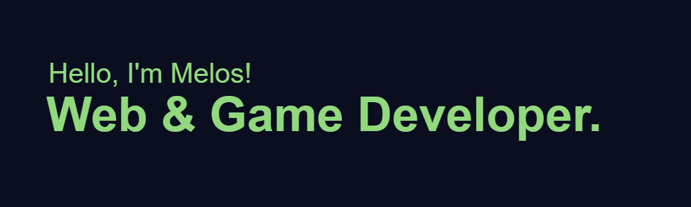

  

</a> 

 - 🔭 I’m currently working on <a href="https://github.com/m-bobi/CoffeeShop">MCoffee Shop

 - 🌱 I’m currently learning <strong>JS Frameworks, Java, Unity</strong> 

 - 👨‍💻 All of my projects are available at <a href="m-bobi.github.io">m-bobi.github.io

<h3 align="center">Connect with me:</h3>

<h3 align="center">Languages and Tools:</h3>

            

 
